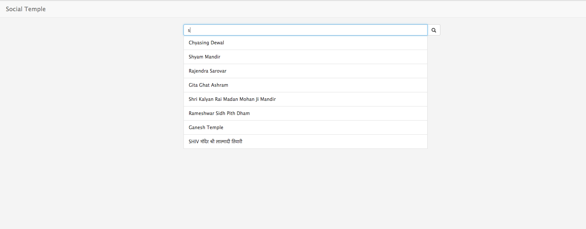
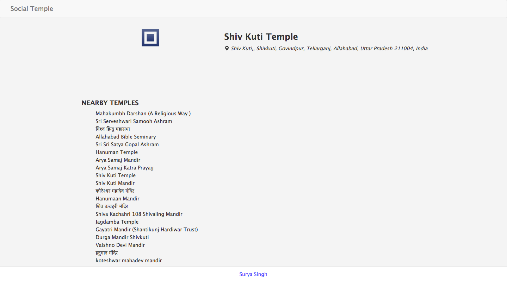

## Social Temple

### Configuration
- **Platform:** node
- **Framework**: express
- **Template Engine**: ejs
- **CSS Framework**: bootstrap
- **CSS Preprocessor**: css

### How to Run : 
 - npm install
 - npm start

### Images

##Web View

## Mobile View

<img src="src/public/images/img2.png"